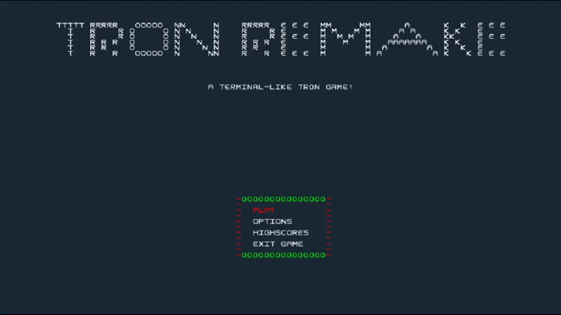

# LPOO_78 - Tron Remake
Nome do projeto: Tron Remake (Terminal Tron)

## Descrição: 
Jogo inspirado no Tron, em que cada jogador é um carro e que deixa um rasto com a sua cor por onde passa. Para vencer tem que fazer com que os outros jogadores atravessem o seu rasto. 

## Funcionalidades
### Funcionalidades implementadas
**Menu** - Um menu para aceder ao jogo, pontuações, a definições e para terminar o programa.

**Construção da Arena** - 2 carros e paredes nas margens do ecrã são adicionadas na construção inicial da arena.

**Movimento dos carros** - Os carros movem-se automaticamente de acordo com a sua orientação. O movimento automático dos carros é feito com ajuda de uma *thread* auxiliar.

**Deteção de colisão com as paredes** - O jogo deteta e processa colisões entre carros e paredes e entre dois carros. Quando um carro colide com uma parede ou outro carro, perde uma vida e aparece numa nova posição aleatória no mapa.

**Diferentes tipos de carros** - Carros deixam rastos diferentes (linha, círculo). Implementamos uma grande variedade de cores para os carros.

**Rasto dos carros** - Os carros deixam um rasto de paredes pelas posições que passam. O rasto é configurável e a sua cor é igual à cor do carro que deixou o rasto.

**Tabela de pontuações** - Tabela que guarda as pontuações de todos os jogos: o vencedor (número do jogador) e a sua pontuação (proporcional à duração do jogo).

Todo o código que consideramos relevante testar, está a ser testado.

### Imagens de funcionalidade implementadas
#### Menu Principal:

#### Menu de Opções:

#### Três melhores pontuações de sempre:

#### Jogo:

#### Menu de pausa:

#### Ecrã de final do jogo:

### Funcionalidades a implementar

**Dois modos de jogo** - Um modo em que o rasto se mantém, e outro em que o rasto vai desaparecendo (segundo modo não implementado).

**Multi-jogador** - Possibilidade de jogar com mais que 2 jogadores.

## Modelo Arquitetural
### MVC - Model-View-Controller
O modelo de arquitetura utilizado foi o MVC, um padrão arquitetural muito usado em *user interfaces*.
O seu desenvolvimento tem-se dado de acordo com o seguinte *flow chart*, presente nos apontamentos do prof. André Restivo.

## Design Patterns
### Problema 1
#### Descrição
Pode-se considerar que o jogo tem vários estados diferentes. Um [estado](../src/main/java/Controller/State/GameState.java) para cada menu que o utilizador pode aceder e mais um estado para o jogo: *Main Menu*, *Options Menu*, *Pause Menu*, *Game Over*, *High Scores*, *In Game*.
#### Pattern: State
Este padrão permite-nos lidar com todos os diferentes estados do jogo da mesma forma. A transição de estados acontece por input do utilizador, à exceção da transição *InGameState* -> *GameOverState* que é causada pelo fim do jogo. Note-se que esta padrão permite que cada estado funcione de forma independente.
#### Implementação
A nossa implementação em UML:

As classes referentes a este *design pattern* são as seguintes:

* [**MenuState**](../src/main/java/Controller/State/MenuState.java)

* [**OptionsState**](../src/main/java/Controller/State/OptionsState.java)

* [**HighScoresState**](../src/main/java/Controller/State/HighScoresState.java)

* [**InGameState**](../src/main/java/Controller/State/InGameState.java)

* [**PauseState**](../src/main/java/Controller/State/PauseState.java)

* [**GameOverState**](../src/main/java/Controller/State/GameOverState.java)

Por questões de simplicadade não mostramos que cada estado concreto está associado a uma vista (um objeto) diferente. O método [*draw*](../src/main/java/View/State/MenuView.java) de cada estado (à exceção do *InGameState*) chama o método *draw* da respetiva vista. Por sua vez, o estado *InGameState* deixa ao critério do [*ArenaController*](../src/main/java/Controller/ArenaController.java) quando desenhar o ecrã. A classe *ArenaController* não está representada no diagrama por questões de simplicidade, mas é um objeto associado ao *InGameState*, que como o seu nome indica controla o que acontece no jogo.
#### Consequências
Uma das consequências deste *Design Pattern* é que o programa siga uma máquina de estados. A máquina de estados resultante:

Como já foi referido, ao nível da aplicação, não distinguimos estados diferentes. Logo, tratamos todos os estados como iguais. Isto faz com que tudo relacionado com o funcionamento de cada estado tenha de estar dentro do seu objeto-estado e da sua vista. Desta forma, este padrão contribui para que o nosso programa cumpra o princípio *Single Responsibility* dos princípios *SOLID*.

Como o funcionamento de todos os estados é independente, para adicionar um novo estado, um novo menu por exemplo, podemos fazê-lo sem alterar código dos outros estados, mas apenas adicionando um objeto-estado, uma vista, e pelo menos uma transição. Assim, este padrão contribui para o princípio *Open Closed* dos princípios *SOLID*.

### Problema 2
#### Descrição
Devido à fragmentação do jogo em várias classes, é necessário manter consistência entre os diferentes objetos de modo a que seja possível representar a *vista* da arena a partir dos dados da *ArenaModel*. Assim, de forma a não desenhar a vista sem que lhe tenham sido feitas modificações, é necessária a implementação de um tipo de observador da *View*. Assim, apenas é necessário desenhar de novo a *View* quando de facto houveram mudanças à *ArenaModel*, ou seja, quando os observadores são notificados de alguma mudança aos objedos da classe observada.
#### Pattern: Observer
Este padrão implementa uma classe abstrata de objetos que serão observados (*Observable*) por objetos que implementam uma interface *Observer*. Como os nomes indicam, a classe *Observable* vai ser "observada" por um objeto que implemente a interface *Observer*. A utilização deste *design pattern* permite-nos tratar diferentes observadores da mesma forma, embora tenhamos apenas implementado um objeto da classe *Observer*.
#### Implementação
A nossa implementação em UML: 

A implementação do padrão no nosso código foi feita da seguinte forma: Acrescentamos uma interface [*Observer*](../src/main/java/Observer/Observer.java) e uma classe abstrata [*Observable*](../src/main/java/Observer/Observable.java). No contexto do nosso problema, fizemos da classe *ArenaModel* um classe derivada de *Observable* e a classe *ArenaView* passou a implementar a interface *Observer*. Para além disto, tivemos também de adicionar a *ArenaView* aos *observers* da *ArenaModel*. Assim, sempre que fazemos uma alteração aos objetos pertencentes à classe *ArenaModel*, notificamos os observadores (neste caso o único observador é a *ArenaView*) e cada um vai adaptar a sua representação dos dados. No contexto do nosso problema, a *ArenaView* é notificada sempre que os carros avançam ou os carros mudam de direção.

#### Consequências
Aplicar este padrão ajuda a que o código cumpra o princípio *Open Closed* dos princípios *SOLID*. Isto acontece porque se quisermos adicionar um novo observador da classe *ArenaModel*, seria simples de o fazer: apenas teríamos de criar uma nova classe que implementasse a interface *Observer* e que tivesse algum tipo de vista configurada. Também precisávamos de adicionar um objeto da nova classe aos observadores da *ArenaModel*. Desta forma, para adicionar novas funcionalidades ao programa, neste caso interfaces gráficas diferentes, não teríamos de alterar código já feito, mas apenas adicionar novo código.

## Code Smells/Problemas de desenvolvimento
### Problema 1 - *Code Smell*
#### Descrição
Quando desenhamos um carro, precisamos de saber se é o carro do jogador 1 ou do jogador 2 para podermos utilizar a cor certa. Podemos extender este problema também para o desenho das paredes. Este problema resultou num *switch statement* complexo.
#### Refactor: Replace Conditional with Polymorphism
Adicionamos um atributo *color* a [*Car*](https://github.com/FEUP-LPOO/lpoo-2020-g78/blob/master/src/main/java/Model/Car.java#L71) e a [*Wall*](https://github.com/FEUP-LPOO/lpoo-2020-g78/blob/master/src/main/java/Model/Wall.java#L12). Esta resolução adiciona o método *getColor()* a ambos os objetos permitindo-nos obter a cor a utilizar ao desenhar os objetos.
### Problema 2 - *Code Smell*
#### Descrição
Na package View, tinhamos duas classes que foram retiradas chamadas *CarView* e *WallView*. Ambas estas classes tinham apenas 1 método *drawCar* e *drawWall* respetivamente. Não tinham nenhum atributo, apenas delegavam trabalho. Portanto, estávamos perante um *Middle Man*.
#### Refactor: Remove Middle Man
Face a este *code smell* passamos as funções *drawCar* e *drawWall* para a classe [*ArenaView*](https://github.com/FEUP-LPOO/lpoo-2020-g78/blob/master/src/main/java/View/ArenaView.java#L106), onde toda a arena é desenhada no ecrã. As classes *CarView* e *WallView* foram eliminadas.
### Problema 3 - *Code Smell*
#### Descrição
A função canCarMove verifica se uma posição colide com alguma parede da *arena*. Pertencia a uma classe CarController. Ao contrário do que o nome indica, não acede a dados de um objeto *Car*. Estávamos perante o *code smell* "Feature Envy".
#### Refactor: Move Method
A função passou a pertencer à classe *PlayerPositionUpdater*. Como CarController só tinha esta função, eliminamos a classe.

**Atualização para a versão final**: A função canCarMove passou a ser a função [*checkCollision*](https://github.com/FEUP-LPOO/lpoo-2020-g78/blob/master/src/main/java/Controller/PlayerPositionUpdater.java#L31) da classe *PlayerPositionUpdater*. A função passou a distinguir tipos diferentes de colisões: colisões entre carros e colisões entre um carro e uma parede.
### Problema 4 - Problema de desenvolvimento
#### Descrição - Acesso Multi-Thread a memória
No estado *InGameState*, o programa tem duas *threads* a correr. Uma *thread* está a ler inputs do utilizador para mudar as direções dos carros e a outra *thread* está a atualizar as posições dos carros dependendo das orientações respetivas a cada carro. Esta forma de "trabalho" resultava em *crashs* aleatórios do programa por acessos à mesma memória em simultâneo.
#### Solução - Implementação de um Mutex
Para fazermos sincronização das threads implementamos um *mutex*, a classe [*MutexSyncronize*](../src/main/java/Controller/MutexSyncronize.java). Funciona de uma forma muito simples: a classe tem um indicador *static* que representa o bloqueio do *mutex*. Antes de todos os acessos a memória de cada *thread* bloqueamos o *mutex* e quando deixamos de aceder a memória, desbloquamos o *mutex*. Repare-se que se o *mutex* estiver bloqueado quando o vamos aceder, a *thread* entrará num [ciclo vazio](https://github.com/FEUP-LPOO/lpoo-2020-g78/blob/master/src/main/java/Controller/MutexSyncronize.java#L8) até o *mutex* ser desbloqueado pela outra *thread*. Desta forma evitámos o acesso simultâneo à mesma memória, e o programa deixou de crashar. 
### Problema 5 - *Code Smell*
#### Descrição
Nos estados-menu em que a interface com o utilizador é feita em modo de navegação (*MainMenu*, *OptionsMenu*, *PauseMenu*), tivemos problemas com a maneira como implementavamos a transição de opção selecionada. Inicialmente abordamos este problema com *switch statements* e portanto estavamos perante um *code smell*.
#### Refactor: Extract Method
O refactor mais parecido com o que fizemos é o *Extract Method*, uma vez que resolvemos o problema com uma expressão matemática e substituimos o *switch statement* por dois [métodos](https://github.com/FEUP-LPOO/lpoo-2020-g78/blob/master/src/main/java/View/State/MenuView.java#L23). Considerando que sabemos qual a opção selecionada com um número inteiro (vamos chamar-lhe *selected*) que o seu valor máximo varia com o número de opções que um menu tem, a função matemática funciona da seguinte forma: se queremos subir no menu, vamos decrementar *selected* e atribuir a si mesmo o valor do resto da divisão pelo número de opções do menu. Para descermos no menu, fazemos o mesmo processo à exceção de que incrementamos *selected*.

Para o menu de [opções](https://github.com/FEUP-LPOO/lpoo-2020-g78/blob/master/src/main/java/View/State/OptionsView.java) temos 4 dimensões deste problema: navegamos sobre qual opção mudar, escolha da cor do jogador 1, escolha da cor do jogador 2 e a escolha dos rastos de cada jogador (como só há dois diferentes, se alterarmos um deles o outro será escolhido por exclusão de partes). 

**Nota**: Matematicamente o resto da divisão de um número negativo por um número positivo resulta num número positivo, mas a implementação do *Java* não respeita essa regra. Para isso tivemos de ser nós a implementar esse detalhe.
### Problema 6 - *Code Smell*
#### Descrição
Ao implementar o padrão *State* que foi explicado anteriormente, reparamos que era necessário que os dados do jogo não estivessem só presentes para estado *InGameState*, uma vez que se isso acontecesse quando transitavamos para o estado *PauseState* quando voltavamos a transitar para o estado do jogo, o jogo recomeçava. Face a este problema, decidimos que fosse pertinente que os dados do jogo (classe *ArenaModel*) estivessem associados à classe *Game* e assim o jogo é "movido" entre todos os estados. No entanto, deparamo-nos com vários *code smells* do tipo *Data Clumps*. A classe do estado do jogo estava associada à classe *Game* para além de estar associada à vista e aos dados do jogo. A vista e os dados do jogo obtiam-se a partir de *getters* da classe *Game*. Estavamos perante isto:

#### Refactor: *Introduce Parameter Object*
A nossa solução a este problema foi a seguinte:

Assim, deixamos de ter objetos repetidos, e o código passa a ser mais "alterável", no sentido em que para o eventual caso de se substituirmos algum dos objetos *ArenaModel* ou *ArenaView* apenas temos de substituir o objeto na classe *Game*.
### Problema 7 - Problema de desenvolvimento
#### Descrição - Contagem de tempo apenas em estados especifícos
Para implementar a funcionalidade de mostrar o tempo decorrido desde o início do jogo, tivemos de recorrer à classe *Date* pertencente ao *Java*. O problema apareceu quando reparamos que só queríamos que o programa incrementasse o contador de tempo decorrido quando o estado do programa fosse *InGameState*. Começávamos a contar o tempo decorrido quando o construíamos o objeto *ArenaModel*, e como *ArenaModel* está associado à classe *Game* e os objetos *Game* e *ArenaModel* são construidos no início do jogo, em prática, o tempo decorrido era incrementado quando estávamos em qualquer estado do jogo.
#### Solução - Implementação de um objeto *Timer*
A nossa abordagem a este problema, foi acrescentar uma classe [*Timer*](../src/main/java/Model/Timer.java) que permite interromper e retomar a contagem do tempo com dois métodos *start* e *stop*. Esta classe foi associada à classe *ArenaModel*, uma vez que consideramos que o tempo decorrido desde o início do jogo é um "dado" do jogo. 
### Problema 8 - *Code Smell*
#### Descrição
Nas fases inicais do desenvolvimento do jogo, pensamos que fosse pertinente que o carácter pelo qual uma parede é representada fizesse parte do objeto *Wall*. Mais tarde, mudamos de ideias fizemos com que o carácter dependesse do "contexto" em que a parede está inserida. Se for uma parede de limite da arena este caracter é representada por um espaço, se for a parede do rasto de um carro, depende das configurações do carro. Ao implementar esta ideia, deixamos as paredes com um método *getWall* que retornava sempre o carácter de uma parede-limite.
#### Refactor: *Remove Method*
O método *getWall* foi removido e alteramos a representação das paredes-limite para que fossem representadas pelo carácter constante [' '](https://github.com/FEUP-LPOO/lpoo-2020-g78/blob/master/src/main/java/View/ArenaView.java#L120). As paredes dos carros passaram a ser representada em conjunto com os carros para terem acesso ao [tipo de parede](https://github.com/FEUP-LPOO/lpoo-2020-g78/blob/master/src/main/java/View/ArenaView.java#L112) do rasto do carro.

## Potenciais *Code Smells*
### 1. *Switch Statements* de leitura e processamento de teclas do utilizador
A leitura de input do teclado e o seu processamento, são feitos com *switch statements*. Isto significa, que se quisermos adicionar novos controlos ao jogo teremos de alterar código espalhado por várias classes, violando o princípio *Open Closed* dos princípios *SOLID*. Nessa situação, potencialmente, vamos gerar um *shotgun surgery code smell*. No entanto, consideramos estes *switch statements* imprescindíveis.

A leitura de input do teclado é feita nas classes:

* [*ArenaView*](https://github.com/FEUP-LPOO/lpoo-2020-g78/blob/master/src/main/java/View/ArenaView.java#L55)

* [*MainMenuView*](https://github.com/FEUP-LPOO/lpoo-2020-g78/blob/master/src/main/java/View/State/MainMenuView.java#L27)

* [*HighScoresView*](https://github.com/FEUP-LPOO/lpoo-2020-g78/blob/master/src/main/java/View/State/HighScoresView.java#L50)

* [*GameOverView*](https://github.com/FEUP-LPOO/lpoo-2020-g78/blob/master/src/main/java/View/State/GameOverView.java#L44)

* [*OptionsView*](https://github.com/FEUP-LPOO/lpoo-2020-g78/blob/master/src/main/java/View/State/OptionsView.java#L49)

* [*GameOverView*](https://github.com/FEUP-LPOO/lpoo-2020-g78/blob/master/src/main/java/View/State/PauseView.java#L26)

### 2. *Selected* do problema 5
Embora tenhamos resolvido o problema dos *switch statements* para a navegação do menu, quando selecionamos uma opção (carregar no Enter) continuamos a ter *switch statements*. A solução ideal para isto seria implementar um outro padrão *State*: os estados diferentes seriam as várias opções que podem ser selecionadas. Não implementamos esta solução porque consideramos que seria "matar uma mosca com uma bala de canhão". Adicionariamos complexidade ao código e seria uma solução bastante menos legível que a nossa implementação. No entanto, promoveria os princípios *Single Responsibility* e *Open Closed* dos princípios *SOLID*. 

*Switch statements* ao carregar no *Enter*:

* [*MainMenuView*](https://github.com/FEUP-LPOO/lpoo-2020-g78/blob/master/src/main/java/View/State/MainMenuView.java#L36)

* [*PauseMenu*](https://github.com/FEUP-LPOO/lpoo-2020-g78/blob/master/src/main/java/View/State/PauseView.java#L39)

* Problema de 4 dimensões - [*OptionsView*](https://github.com/FEUP-LPOO/lpoo-2020-g78/blob/master/src/main/java/View/State/OptionsView.java#L60)

## Testing
Cobertura dos testes obtida pelo *IntelliJ*.

Link para o *IntelliJ testing report* -> https://github.com/FEUP-LPOO/lpoo-2020-g78/tree/master/docs/IntelliJ%20Testing%20Report

Usámos também o *Pitest* para verificar a robustez dos testes criados.

Link para *mutation testing report* -> https://github.com/FEUP-LPOO/lpoo-2020-g78/tree/master/docs/Mutation%20Testing%20Report

## Auto-avaliação
50% - João Castro Pinto
50% - Miguel Silva
